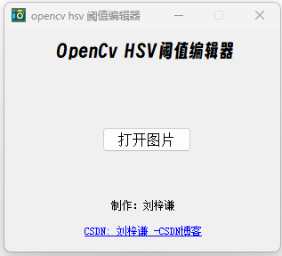

# 说明文档

## 一、仓库用途

- 这是一个基于 Qt 实现的 Opencv 阈值编辑器软件，运行在 windows 环境下

## 二、使用说明及注意事项

### 2.1 使用说明

打开 **app** 文件下的 **.exe** 文件即可直接运行

> 注意：只有在 Windows 环境下以及X64平台下能够运行

### 2.2 注意事项

- 由于不同显示器显示的效果不尽相同，所以可能会对窗口进行一定比例缩放，有可能会遮挡字体，这是正常现象

- 如下所示为本软件的封面：

  

> **注意事项：打开的图片目录中不能包含中文字符，否则软件会崩溃**

- 打开图片后的界面如下所示：

  

  - 可以通过拖动滑轨进行调节，也可以通过滑轨后面的数字进行编辑
  - **Scalar**复选框的作用是便于使用opencv过程中直接复制，**可以选择是否使能 Scalar**，对阈值结果无影响，只影响输出数据的格式

## 三、总结

- 使用过程中，如果遇到问题，欢迎大家联系我，以下是我的联系方式：

  - 个人CSDN账号：[刘梓谦_-CSDN博客](https://blog.csdn.net/liujiahao_)

  - Gitee：[刘佳豪 (liu-jiahaohappy) - Gitee.com](https://gitee.com/liu-jiahaohappy)

  - GitHub：[Jiahao-Liu29 (github.com)](https://github.com/Jiahao-Liu29)

